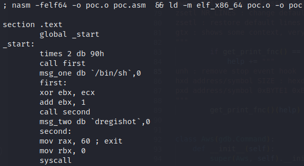
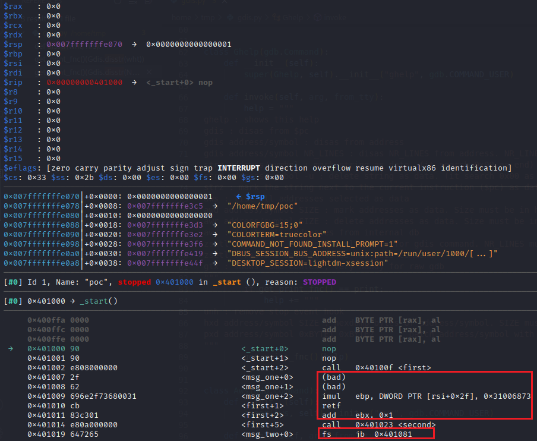
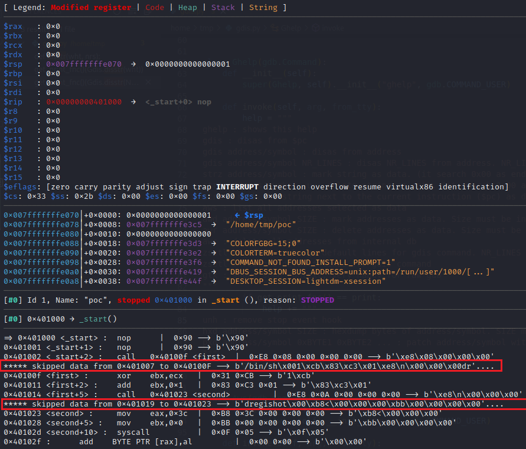

# gdis
GDB plugin to debug instructions mixed with data. GDB-GEF support included

Do you need debug with GDB-GEF a shellcode/malware/packer code like this?

Then gdis can help you

## Before gdis

## After gdis

## Tutorial

Basic tutorial: see **tutorial.pdf**

Or check my post:

https://medium.com/@therealdreg/how-to-debug-instructions-mixed-with-data-using-gdb-gef-5acffce3bb18
